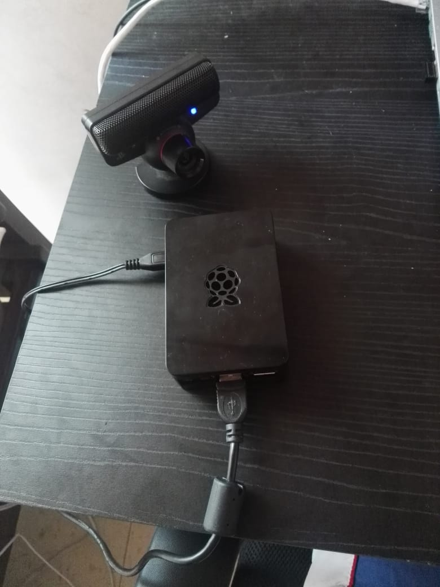

# Proyecto_Final_Ubicuos

En este proyecto vamos a presentar un generador de mapas de calor para identificar el recorrido en lugares y así tomar decisiones respecto a la distribucion de diferentes sitios.

# Imagenes hardware y funcionamiento

En esta sección les compartimos el funcionamiento del código en la raspberry pi, y las imagenes del hardware, para esto solo necesitamos una raspberry pi y una camara que sea compatible con la raspberry, en este caso utilizamos una camara normal de 5 pixeles, no mostramos el funcionamiento con la cámara ya que no hay sitio en donde probar de manera correcta el funcionamiento de mapas de calor, a continuacion podemos observar que la raspberry si soporta el procesmaiento de imagenes del código y tambin el hardware.

